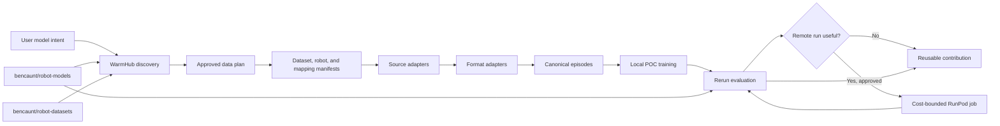

# Architecture

WarmHub is the control plane; upstream hosts remain the payload plane.



## Boundaries

| Layer | Owns | Does not own |
| --- | --- | --- |
| WarmHub discovery | identity, relationships, evidence, provenance, URLs | bulk payload bytes |
| Dataset manifest | declarative mapping and compatibility | transport implementation |
| Dataset-robot mapping | feature/joint names, affine transforms, units, coverage, evidence, validation status | global robot identity |
| Source adapter | download, authentication, resume, checksum | dataset schema |
| Format adapter | source layout, payload selection, and canonical episodes | recipe-specific training |
| Visual cache | video decoding, exact frame alignment, fully fingerprinted encoder/RGB transform, reusable features | source transport or model training |
| Recipe | mixture, modalities, model and evaluation contract | one-off extraction logic |
| Compute adapter | device or remote lifecycle | model semantics |
| Rerun evaluator | inspectable inputs, predictions, metrics, robot geometry | training decisions |

## Initial package boundaries

```text
robot_world_models.contracts  manifest types and validation
robot_world_models.catalog    deterministic catalog discovery and generation
robot_world_models.warmhub    read-only typed wrapper around the wh CLI
robot_world_models.adapters   versioned source and format adapters
robot_world_models.devices    MPS/CUDA/CPU selection
robot_world_models.runpod     plan and policy only in v0.1
robot_world_models.models     recipe-selected MLP and spatial-transformer reference models
robot_world_models.eval       mandatory Rerun receipts
robot_world_models.training   receipt-producing local recipe runner
robot_world_models.visual_data  video decoding and frozen-feature cache contract
robot_world_models.visual_training  visual recipe composition, training, and rollout evaluation
```

The first bounded SO-101 spike established two reusable boundaries: source adapters selectively
materialize immutable upstream paths, while format adapters own storage-version parsing and
canonical episode validation. LeRobot library compatibility is not used as a proxy for dataset
storage compatibility.

Nested collections make that boundary explicit. The dataset manifest records the complete,
reviewed member set and exclusions; the recipe selects exact member roots and a download-byte
ceiling. A LeRobot v3 format adapter splits shared Parquet and MP4 chunks back into canonical
episodes using versioned episode metadata. WarmHub retains only compact facts and relationships;
the source host retains every payload byte.

The visual spike adds a third boundary: a visual-feature cache owns the relationship between one
decoded camera frame, the frozen encoder's exact processed view, its spatial latent tokens, and the
RGB reconstruction target. The dynamics model consumes that cache without importing a source or
format adapter. This lets a newly contributed dataset reuse visual training as soon as its adapter
can provide aligned camera paths and canonical episodes.

The visual recipe independently owns spatial pooling and the executable rollout objective. A
one-step recipe and a multi-step recipe can reuse the same feature cache. Multi-step training starts
from real context, then recursively feeds predicted latent grids and predicted state through the
remaining declared horizon. This separation makes representation and dynamics ablations
independently reviewable.

Visual model construction is contract-driven. The trainer dispatches the recipe's declared
implementation to either the tokenwise MLP or the spatiotemporal transformer and rejects unknown
implementations. Both models consume and emit the same spatial-cache contract and share the same
decoder boundary. Transformer-specific fields, such as attention heads, are validated in the
recipe schema rather than hidden in training code.

The transformer treats every time/space feature as a token, appends projected state and action
tokens, encodes that memory, and decodes one learned query per output location. Its feature and
state delta heads start at zero so the untrained model preserves latent persistence and unchanged
state. Persistence and mean-action ablation jointly gate promotion: long-horizon smoothness is not
enough when a model ignores control.
